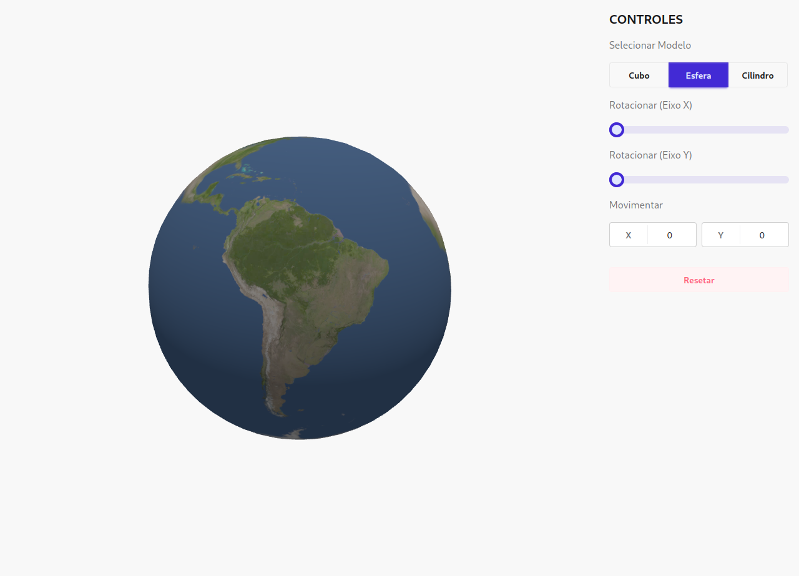

# Atividade Complementar - Computação Gráfica

[Link para a aplicação](https://weslley41.github.io/atividade-computacao-grafica/)

Foi utilizada a biblioteca **three.js** pela sua facilidade de implementação no ambiente web, bem como a adição de modelos, aplicação de texturas e realização de operações nos objetos.

É possível selecionar três objetos diferentes, um **cubo** de cor vermelha, uma **esfera** com textura do globo terrestre ou um **cilindro** com textura de tijolos. As texturas usadas são do [repositório de exemplos](https://github.com/mrdoob/three.js/tree/dev/examples/textures) do three.js. Apenas um objeto é exibido de cada vez para ter melhor visualização do objeto e suas operações.

Foram aplicados dois tipos de iluminação na cena, uma iluminação direcional posicionada mais à direita e acima da visualização inicial, e uma iluminação ambiente mais fraca para dar um pouco de visibilidade nas regiões que não são afetadas pela iluminação direcional.

As operações escolhidas foram translação, com opções de movimentar o objeto pelas coordenadas X e Y, e a rotação, permitindo rotacionar o objeto pelos eixos X e Y no intervalo de ângulos 0° a 360°.
